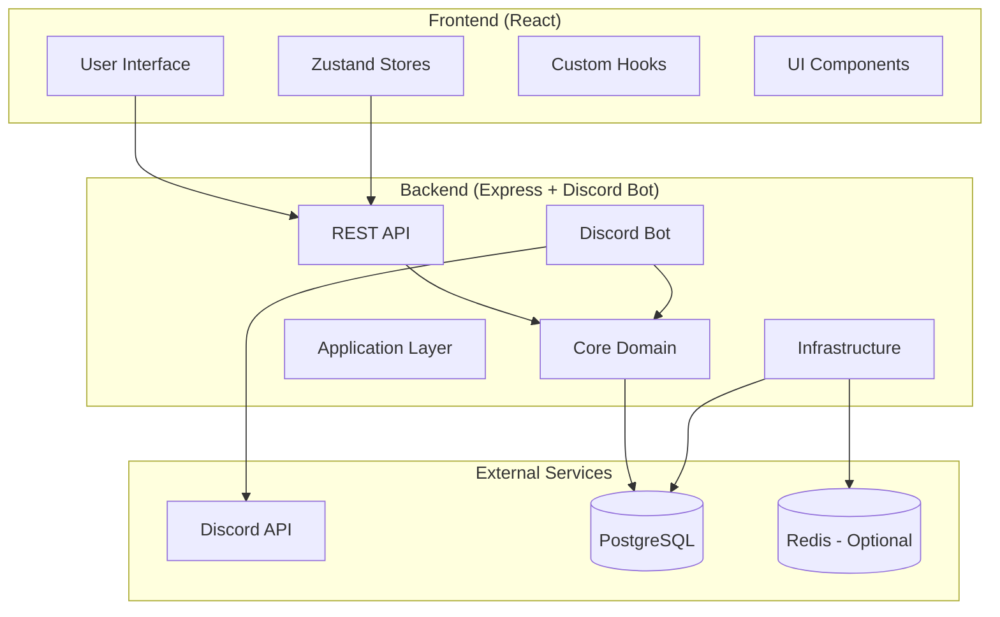
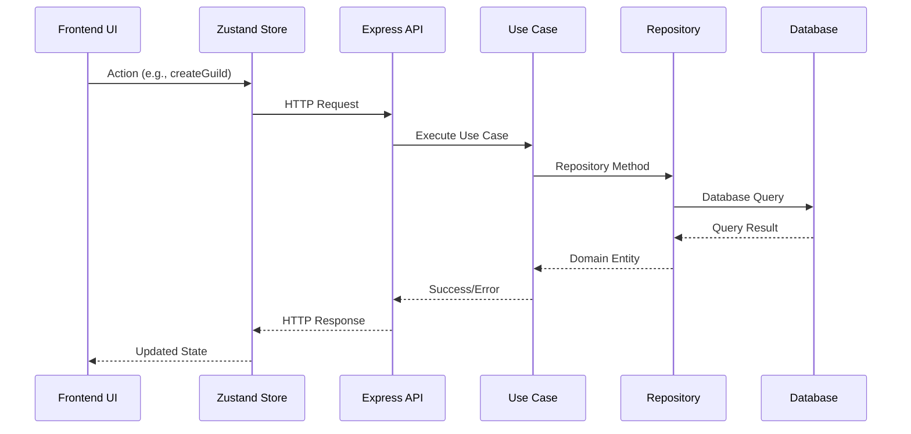
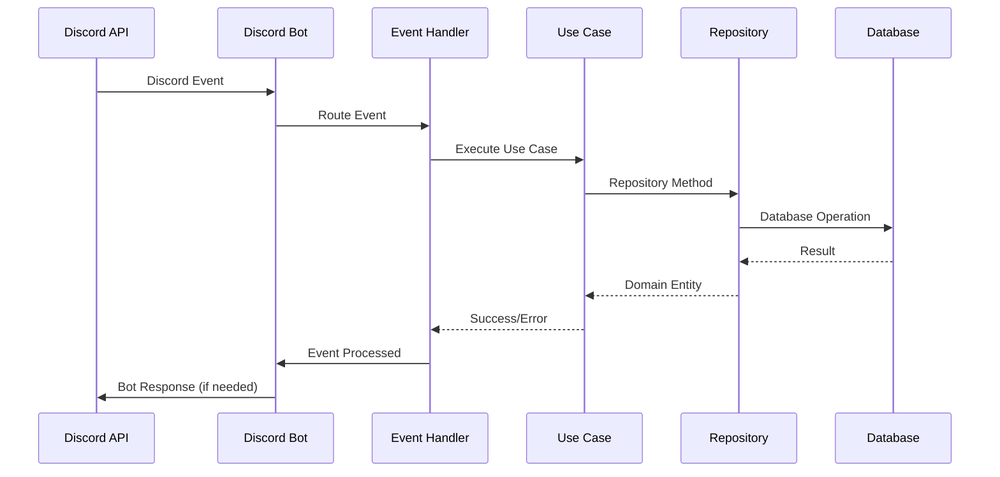

# Architecture Documentation

This document provides a comprehensive overview of WingTechBot MK3's architecture, design patterns, and architectural decisions.

## 🏗️ High-Level Architecture

WingTechBot MK3 follows a modern, scalable architecture with clear separation of concerns:



## 🎯 Design Principles

### 1. Separation of Concerns

- **Frontend**: UI logic and user interactions
- **Backend**: Business logic and Discord bot functionality
- **Database**: Data persistence and relationships
- **Types**: Shared type definitions

### 2. Hexagonal Architecture (Backend)

The backend follows hexagonal architecture (ports and adapters) to maintain:

- **Independence from external frameworks**
- **Testability through dependency injection**
- **Flexibility to swap implementations**
- **Clear business logic separation**

### 3. Type Safety

- **Strict TypeScript** configuration across all packages
- **Shared types** between frontend and backend
- **Runtime validation** with Zod schemas
- **Database type safety** with Kysely

### 4. Scalability

- **Modular monorepo** structure
- **Stateless services** (backend API)
- **Caching strategies** (where applicable)
- **Database optimization** with proper indexing

## 📁 Package Architecture

### Backend Architecture (Hexagonal)

```
packages/backend/src/
├── core/                    # Domain Layer (Pure Business Logic)
│   ├── entities/           # Domain entities
│   ├── services/           # Domain services
│   ├── repositories/       # Repository interfaces (ports)
│   └── value-objects/      # Value objects
├── application/            # Application Layer (Use Cases)
│   ├── use-cases/         # Application use cases
│   ├── services/          # Application services
│   └── dto/               # Data transfer objects
├── adapters/              # Adapters (Interface Implementations)
│   ├── http/              # HTTP controllers
│   ├── discord/           # Discord event handlers
│   ├── database/          # Database implementations
│   └── external/          # External service adapters
└── infrastructure/        # Infrastructure Layer (Framework Code)
    ├── config/            # Configuration
    ├── database/          # Database setup
    ├── discord/           # Discord client setup
    ├── middleware/        # Express middleware
    └── server/            # Server configuration
```

#### Core Layer (Domain)

The innermost layer containing pure business logic:

```typescript
// Example: Guild entity
export interface Guild {
  readonly id: string;
  readonly name: string;
  readonly ownerId: string;
  readonly memberCount: number;
  readonly isActive: boolean;
  readonly createdAt: Date;
  readonly updatedAt: Date;
}

// Example: Repository port
export interface GuildRepository {
  findById(id: string): Promise<Guild | null>;
  create(guild: CreateGuildData): Promise<Guild>;
  update(id: string, data: UpdateGuildData): Promise<Guild>;
  delete(id: string): Promise<void>;
}
```

#### Application Layer (Use Cases)

Contains application-specific business rules and orchestrates domain objects:

```typescript
// Example: Use case
export class CreateGuildUseCase {
  constructor(
    private readonly guildRepository: GuildRepository,
    private readonly logger: Logger
  ) {}

  async execute(data: CreateGuildData): Promise<Guild> {
    // Validation and business logic
    const existingGuild = await this.guildRepository.findById(data.id);
    if (existingGuild) {
      throw new Error('Guild already exists');
    }

    // Create guild
    const guild = await this.guildRepository.create(data);
    this.logger.info(`Guild created: ${guild.name}`);

    return guild;
  }
}
```

#### Adapters Layer (Interface Implementations)

Implements the ports defined in the core layer:

```typescript
// Example: Database adapter
export class KyselyGuildRepository implements GuildRepository {
  constructor(private readonly db: Kysely<DB>) {}

  async findById(id: string): Promise<Guild | null> {
    const result = await this.db
      .selectFrom('guilds')
      .selectAll()
      .where('id', '=', id)
      .executeTakeFirst();

    return result ? this.mapToEntity(result) : null;
  }

  // ... other implementations
}
```

#### Infrastructure Layer (Framework)

Contains framework-specific code and configuration:

```typescript
// Example: Express controller
export class GuildController {
  constructor(
    private readonly createGuildUseCase: CreateGuildUseCase,
    private readonly getGuildUseCase: GetGuildUseCase
  ) {}

  async createGuild(req: Request, res: Response): Promise<void> {
    try {
      const guild = await this.createGuildUseCase.execute(req.body);
      res.status(201).json(guild);
    } catch (error) {
      res.status(400).json({ error: error.message });
    }
  }
}
```

### Frontend Architecture (Component-Driven)

```
packages/frontend/src/
├── components/             # Reusable UI components
│   ├── common/            # Generic components (Button, Input, etc.)
│   ├── layout/            # Layout components (Header, Sidebar, etc.)
│   └── features/          # Feature-specific components
├── hooks/                 # Custom React hooks
│   ├── api/               # API-related hooks
│   ├── form/              # Form handling hooks
│   └── ui/                # UI-related hooks
├── stores/                # Zustand state stores
│   ├── authStore.ts       # Authentication state
│   ├── guildStore.ts      # Guild-related state
│   └── uiStore.ts         # UI state (modals, theme, etc.)
├── types/                 # Frontend-specific types
├── utils/                 # Utility functions

└── App.tsx               # Main application component
```

#### Component Structure

Following atomic design principles:

```typescript
// Example: Compound component pattern
export const GuildCard = {
  Root: ({ children, guild }: GuildCardProps) => (
    <div className="guild-card" data-guild-id={guild.id}>
      {children}
    </div>
  ),

  Header: ({ guild }: { guild: Guild }) => (
    <div className="guild-card-header">
      <h3>{guild.name}</h3>
      <span className="member-count">{guild.memberCount} members</span>
    </div>
  ),

  Actions: ({ guild, onEdit, onDelete }: GuildActionsProps) => (
    <div className="guild-card-actions">
      <Button onClick={() => onEdit(guild)}>Edit</Button>
      <Button variant="danger" onClick={() => onDelete(guild)}>Delete</Button>
    </div>
  )
};

// Usage
<GuildCard.Root guild={guild}>
  <GuildCard.Header guild={guild} />
  <GuildCard.Actions guild={guild} onEdit={handleEdit} onDelete={handleDelete} />
</GuildCard.Root>
```

#### State Management

Using Zustand for predictable state management:

```typescript
// Example: Guild store
interface GuildStore {
  guilds: Guild[];
  selectedGuild: Guild | null;
  isLoading: boolean;
  error: string | null;

  // Actions
  fetchGuilds: () => Promise<void>;
  selectGuild: (guild: Guild) => void;
  createGuild: (data: CreateGuildData) => Promise<void>;
  updateGuild: (id: string, data: UpdateGuildData) => Promise<void>;
  deleteGuild: (id: string) => Promise<void>;
}

export const useGuildStore = create<GuildStore>((set, get) => ({
  guilds: [],
  selectedGuild: null,
  isLoading: false,
  error: null,

  fetchGuilds: async () => {
    set({ isLoading: true, error: null });
    try {
      const guilds = await guildApi.getGuilds();
      set({ guilds, isLoading: false });
    } catch (error) {
      set({ error: error.message, isLoading: false });
    }
  },

  // ... other actions
}));
```

### Types Package Architecture

```
packages/types/src/
├── api/                   # API-related types
│   ├── requests.ts        # Request DTOs
│   ├── responses.ts       # Response DTOs
│   └── errors.ts          # Error types
├── domain/               # Domain entity types
│   ├── guild.ts          # Guild types
│   ├── user.ts           # User types
│   └── discord.ts        # Discord-specific types
├── database/             # Database types
│   └── schema.ts         # Database schema types
└── index.ts              # Main exports
```

## 🔄 Data Flow

### API Request Flow



### Discord Event Flow



## 🔧 Dependency Injection

### Backend DI Container

Using a simple dependency injection pattern:

```typescript
// Container setup
export class DIContainer {
  private services = new Map<string, any>();

  register<T>(key: string, factory: () => T): void {
    this.services.set(key, factory);
  }

  resolve<T>(key: string): T {
    const factory = this.services.get(key);
    if (!factory) {
      throw new Error(`Service ${key} not registered`);
    }
    return factory();
  }
}

// Service registration
const container = new DIContainer();

// Infrastructure
container.register('database', () => createDatabaseConnection());
container.register('logger', () => createLogger());

// Repositories
container.register(
  'guildRepository',
  () => new KyselyGuildRepository(container.resolve('database'))
);

// Use Cases
container.register(
  'createGuildUseCase',
  () => new CreateGuildUseCase(container.resolve('guildRepository'), container.resolve('logger'))
);

// Controllers
container.register(
  'guildController',
  () =>
    new GuildController(
      container.resolve('createGuildUseCase'),
      container.resolve('getGuildUseCase')
    )
);
```

## 📊 Database Architecture

### Schema Design

```sql
-- Core entities
CREATE TABLE guilds (
    id VARCHAR(20) PRIMARY KEY,
    name VARCHAR(255) NOT NULL,
    owner_id VARCHAR(20) NOT NULL,
    member_count INTEGER DEFAULT 0,
    is_active BOOLEAN DEFAULT TRUE,
    created_at TIMESTAMP DEFAULT CURRENT_TIMESTAMP,
    updated_at TIMESTAMP DEFAULT CURRENT_TIMESTAMP
);

CREATE TABLE users (
    id VARCHAR(20) PRIMARY KEY,
    username VARCHAR(255) NOT NULL,
    discriminator VARCHAR(4),
    avatar_url TEXT,
    created_at TIMESTAMP DEFAULT CURRENT_TIMESTAMP,
    updated_at TIMESTAMP DEFAULT CURRENT_TIMESTAMP
);

CREATE TABLE guild_members (
    guild_id VARCHAR(20) REFERENCES guilds(id),
    user_id VARCHAR(20) REFERENCES users(id),
    joined_at TIMESTAMP DEFAULT CURRENT_TIMESTAMP,
    PRIMARY KEY (guild_id, user_id)
);

-- Indexes for performance
CREATE INDEX idx_guilds_owner_id ON guilds(owner_id);
CREATE INDEX idx_guilds_is_active ON guilds(is_active);
CREATE INDEX idx_guild_members_guild_id ON guild_members(guild_id);
CREATE INDEX idx_guild_members_user_id ON guild_members(user_id);
```

### Migration Strategy

```typescript
// Example migration
export const migration_001_create_guilds = {
  up: async (db: Kysely<any>) => {
    await db.schema
      .createTable('guilds')
      .addColumn('id', 'varchar(20)', col => col.primaryKey())
      .addColumn('name', 'varchar(255)', col => col.notNull())
      .addColumn('owner_id', 'varchar(20)', col => col.notNull())
      .addColumn('member_count', 'integer', col => col.defaultTo(0))
      .addColumn('is_active', 'boolean', col => col.defaultTo(true))
      .addColumn('created_at', 'timestamp', col => col.defaultTo(sql`CURRENT_TIMESTAMP`))
      .addColumn('updated_at', 'timestamp', col => col.defaultTo(sql`CURRENT_TIMESTAMP`))
      .execute();
  },

  down: async (db: Kysely<any>) => {
    await db.schema.dropTable('guilds').execute();
  },
};
```

## 🧪 Testing Architecture

### Testing Strategy

```
tests/
├── unit/                  # Unit tests (isolated components)
│   ├── core/             # Domain logic tests
│   ├── application/      # Use case tests
│   └── adapters/         # Adapter tests
├── integration/          # Integration tests (multiple components)
│   ├── api/              # API endpoint tests
│   ├── database/         # Database integration tests
│   └── discord/          # Discord bot tests
└── e2e/                  # End-to-end tests
    ├── user-flows/       # Complete user workflows
    └── api-flows/        # Complete API workflows
```

### Test Examples

```typescript
// Unit test - Domain service
describe('GuildService', () => {
  let guildService: GuildService;
  let mockRepository: jest.Mocked<GuildRepository>;

  beforeEach(() => {
    mockRepository = {
      findById: jest.fn(),
      create: jest.fn(),
      update: jest.fn(),
      delete: jest.fn(),
    };
    guildService = new GuildService(mockRepository);
  });

  describe('createGuild', () => {
    it('should create a guild with valid data', async () => {
      // Arrange
      const guildData = { id: '123', name: 'Test Guild', ownerId: '456' };
      mockRepository.create.mockResolvedValue(guildData as Guild);

      // Act
      const result = await guildService.createGuild(guildData);

      // Assert
      expect(result).toEqual(guildData);
      expect(mockRepository.create).toHaveBeenCalledWith(guildData);
    });
  });
});

// Integration test - API endpoint
describe('POST /api/guilds', () => {
  let app: Express;
  let db: Kysely<DB>;

  beforeAll(async () => {
    db = await createTestDatabase();
    app = createTestApp(db);
  });

  afterAll(async () => {
    await db.destroy();
  });

  beforeEach(async () => {
    await clearDatabase(db);
  });

  it('should create a guild', async () => {
    const guildData = {
      id: '123456789',
      name: 'Test Guild',
      ownerId: '987654321',
    };

    const response = await request(app).post('/api/guilds').send(guildData).expect(201);

    expect(response.body).toMatchObject(guildData);
  });
});
```

## 🚀 Performance Considerations

### Backend Optimizations

- **Database connection pooling** with Kysely
- **Query optimization** with proper indexes
- **Caching** for frequently accessed data
- **Rate limiting** for API endpoints
- **Compression** for HTTP responses

### Frontend Optimizations

- **Code splitting** with React.lazy()
- **Memoization** with React.memo and useMemo
- **Virtual scrolling** for large lists
- **Image optimization** with lazy loading
- **Bundle optimization** with Vite

### Discord Bot Optimizations

- **Event handler optimization** to prevent blocking
- **Memory management** for long-running processes
- **Graceful error handling** to prevent crashes
- **Connection monitoring** and automatic reconnection

## 🔒 Security Architecture

### Authentication & Authorization

- **JWT tokens** for API authentication
- **Discord OAuth** for user authentication
- **Role-based access control** (RBAC)
- **API key management** for external integrations

### Data Protection

- **Input validation** with Zod schemas
- **SQL injection prevention** with Kysely
- **XSS protection** with content security policy
- **Secrets management** with environment variables

### Discord Bot Security

- **Token security** (never expose in logs)
- **Permission validation** before actions
- **Rate limit compliance** with Discord API
- **Graceful error handling** without exposing internals

## 📈 Monitoring & Observability

### Logging Strategy

```typescript
interface LogContext {
  userId?: string;
  guildId?: string;
  action: string;
  metadata?: Record<string, any>;
}

// Structured logging
logger.info('Guild created', {
  guildId: guild.id,
  guildName: guild.name,
  ownerId: guild.ownerId,
  action: 'guild.create',
});
```

### Metrics Collection

- **API response times** and error rates
- **Discord bot event processing** metrics
- **Database query performance** metrics
- **Memory and CPU usage** monitoring

### Health Checks

```typescript
// Health check endpoint
app.get('/health', async (req, res) => {
  const health = {
    status: 'ok',
    timestamp: new Date().toISOString(),
    services: {
      database: await checkDatabase(),
      discord: checkDiscordBot(),
      memory: process.memoryUsage(),
    },
  };

  const isHealthy = Object.values(health.services).every(service => service.status === 'ok');

  res.status(isHealthy ? 200 : 503).json(health);
});
```

This architecture provides a solid foundation for scalability, maintainability, and testability while keeping the codebase organized and easy to understand.
