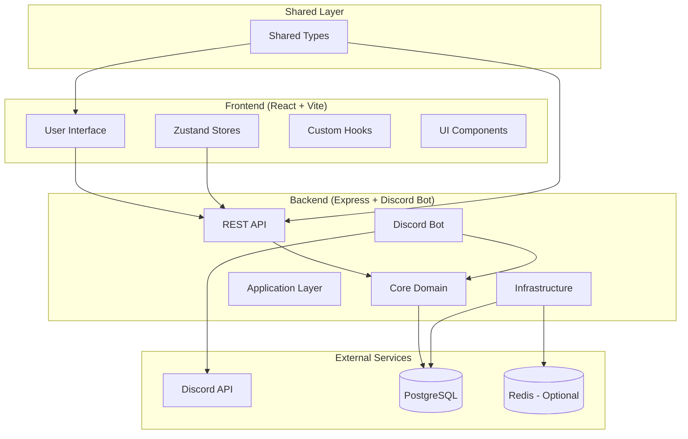
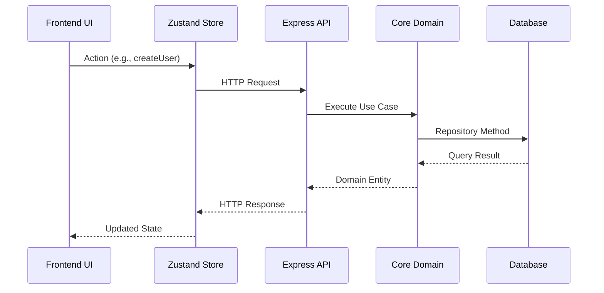
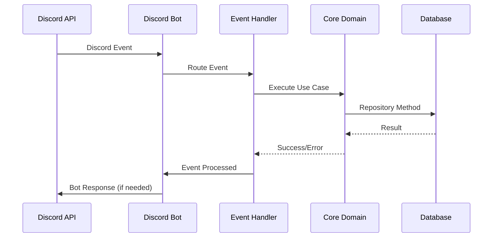

# WingTechBot MK3 - Architecture Analysis

## 🏗️ System Overview

WingTechBot MK3 is a modern full-stack Discord bot application built with TypeScript, following **hexagonal architecture** (ports and adapters) principles. The system is organized as a monorepo with clear separation of concerns across multiple packages.

### High-Level Architecture

## 📦 Package Architecture

### Monorepo Structure

The project uses a **monorepo pattern** with clear package boundaries:

- **Backend Package**: Express.js API and Discord bot functionality
- **Frontend Package**: React web application with modern tooling
- **Types Package**: Shared TypeScript types and validation schemas
- **Documentation Package**: Developer documentation site

This structure enables:
- **Shared code** between packages
- **Independent development** of each package
- **Consistent tooling** across the entire project
- **Simplified dependency management**

## 🎯 Backend Architecture (Hexagonal)

The backend follows **hexagonal architecture** with four distinct layers, each with clear responsibilities and dependencies.

### Layer Structure

The hexagonal architecture is organized into four concentric layers:

1. **Core Layer** (Innermost) - Pure business logic
2. **Application Layer** - Use cases and orchestration
3. **Adapter Layer** - Input/output adapters
4. **Infrastructure Layer** (Outermost) - Technical mechanisms

### Layer Responsibilities

#### Core Layer
- **Pure business logic** with no external dependencies
- Domain entities with business rules and validation
- Domain services and use cases
- Repository interfaces (ports)
- Domain-specific errors and exceptions

#### Application Layer
- **Application contracts** and orchestration
- API version management and contracts
- Route configurations and application logic
- Discord command and event handlers
- Application services and query handlers
- **No HTTP or infrastructure concerns**

#### Adapter Layer
- **Input/Output adapters** connecting external world to application
- HTTP controllers and presenters
- Repository implementations
- Service implementations
- **Clean separation** between different adapter types

#### Infrastructure Layer
- **Technical mechanisms** and frameworks
- HTTP routing and middleware
- Database connections and configuration
- Discord bot setup and configuration
- **No business logic or domain concerns**

## 🔄 Request Flow Patterns

### API Request Flow

The request flow follows a **unidirectional data flow** pattern:

1. **Infrastructure Layer**: Express app receives HTTP request
2. **Adapter Layer**: Controller validates and transforms request
3. **Application Layer**: Use case orchestrates business logic
4. **Core Layer**: Domain service executes business rules
5. **Adapter Layer**: Presenter transforms domain entities to API format
6. **Infrastructure Layer**: HTTP response is sent

### Discord Event Flow

Discord events follow a similar pattern:

1. **Infrastructure Layer**: Discord.js receives event
2. **Adapter Layer**: Event handler processes event
3. **Application Layer**: Command/event use case executes
4. **Core Layer**: Domain logic is applied
5. **Infrastructure Layer**: Bot responds to Discord

## 🎨 Frontend Architecture (Component-Driven)

### Architecture Principles

The frontend follows **component-driven architecture** with:

- **Functional components** with hooks
- **State management** with Zustand
- **Type safety** throughout the application
- **Modern React patterns** and best practices

### State Management Strategy

The frontend uses **Zustand** for state management, providing:
- **Simple, lightweight** state management
- **TypeScript support** with full type safety
- **Easy integration** with React hooks
- **Minimal boilerplate** compared to Redux

### Component Architecture

Components are organized by:
- **Reusability**: Common components for shared UI elements
- **Domain**: Feature-specific components
- **Complexity**: Simple presentational vs. complex container components

## 🗄️ Database Architecture

### Design Principles

The database follows **relational design principles** with:

- **Normalized schema** to reduce data redundancy
- **Proper indexing** for performance
- **Foreign key relationships** for data integrity
- **Audit trails** with timestamps

### Technology Stack

- **PostgreSQL**: Production-ready relational database
- **Prisma**: Database ORM and migration management
- **Kysely**: Type-safe SQL query builder
- **Database migrations**: Version-controlled schema changes

### Data Access Patterns

The application uses **repository pattern** for data access:
- **Repository interfaces** in the core layer
- **Repository implementations** in the adapter layer
- **Type-safe queries** with Kysely
- **Transaction management** for data consistency

## 🔌 API Design Patterns

### Versioned API System

The API follows a **versioned architecture** with:

- **Multiple API versions** for backward compatibility
- **Type-safe contracts** with validation
- **Automatic documentation** generation
- **Clean deprecation** paths

### RESTful Design

The API follows **REST principles**:
- **Resource-based URLs**
- **Standard HTTP methods**
- **Consistent response formats**
- **Proper status codes**

### Request/Response Patterns

All API endpoints follow consistent patterns:
- **Standardized error responses**
- **Validation error details**
- **Pagination for list endpoints**
- **Filtering and sorting options**

## 🤖 Discord Bot Architecture

### Bot Integration

The Discord bot is **integrated into the backend** and follows the same architectural patterns:

- **Event-driven architecture** for Discord events
- **Command pattern** for slash commands
- **State management** for bot interactions
- **Error handling** and logging

### Voice System Design

The voice system uses a **simple, focused architecture**:

- **Clean interface** that abstracts Discord.js complexity
- **State management** for voice sessions
- **Error handling** for voice operations
- **Resource management** for audio playback

## 🔧 Configuration Management

### Configuration Strategy

Configuration follows **environment-based patterns**:

- **Environment variables** for configuration
- **Type-safe configuration** access
- **Validation** on application startup
- **Default values** for development

### Security Considerations

- **Sensitive data** stored in environment variables
- **No hardcoded secrets** in source code
- **Configuration validation** prevents misconfiguration
- **Environment-specific** configurations

## 🧪 Testing Architecture

### Testing Strategy

The application uses a **layered testing approach**:

- **Unit tests** for isolated components
- **Integration tests** for component interactions
- **End-to-end tests** for complete workflows
- **API tests** for endpoint validation

### Testing Patterns

- **Test-driven development** for critical business logic
- **Mocking strategies** for external dependencies
- **Test data management** with fixtures
- **Coverage reporting** for quality assurance

## 🚀 Deployment Architecture

### Containerization Strategy

The application uses **Docker** for deployment:

- **Multi-stage builds** for optimized images
- **Environment-specific** configurations
- **Health checks** for monitoring
- **Resource limits** for stability

### Deployment Patterns

- **Stateless services** for horizontal scaling
- **Database migrations** for schema updates
- **Environment-specific** configurations
- **Monitoring and logging** integration

## 🎯 Key Architectural Benefits

### 1. **Clean Separation of Concerns**
- Business logic isolated in core layer
- API contracts separate from implementation
- Infrastructure separate from application logic

### 2. **Easy Version Management**
- Add new API versions by creating new contract/adapter directories
- Old versions remain isolated and maintainable
- Clear deprecation and migration paths

### 3. **Testability**
- Core layer easily unit testable (no external dependencies)
- Adapters can be mocked or replaced
- Infrastructure can be swapped without affecting business logic

### 4. **Maintainability**
- Clear boundaries between layers
- Easy to find and modify specific concerns
- Consistent patterns across the codebase

### 5. **Scalability**
- Modular monorepo structure
- Stateless services (backend API)
- Database optimization with proper indexing
- Caching strategies where applicable

### 6. **Type Safety**
- Strict TypeScript configuration across all packages
- Shared types between frontend and backend
- Runtime validation with schemas
- Database type safety with query builders

## 🔄 Data Flow Patterns

### API Request Flow

### Discord Event Flow

## 🎉 Summary

WingTechBot MK3 demonstrates a **well-architected, modern full-stack application** with:

- **Hexagonal architecture** ensuring clean separation of concerns
- **Type safety** throughout the entire stack
- **Scalable monorepo** structure
- **Comprehensive testing** strategy
- **Modern tooling** and best practices
- **Discord bot integration** with clean abstractions
- **Production-ready** deployment options

The architecture provides a solid foundation for future development while maintaining code quality, testability, and maintainability. The focus on architectural patterns and design principles rather than specific implementation details makes the system flexible and adaptable to changing requirements. 